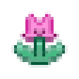

# Mistral AI Pixel Sprites

> An unofficial, searchable collection of **transparent Mistral AI pixel-art sprites**: UI pictograms, model emblems, and animated pixel cats. This repository intentionally excludes website screenshots, page thumbnails, opaque backgrounds, and duplicate assets.


## Library layout

| Folder | Contents | Use |
| --- | --- | --- |
| [`sprites/ui/`](sprites/ui) | Pixel-perfect PNG UI sprites | Use directly in apps and games |
| [`sprites/models/`](sprites/models) | Pixel-perfect PNG Mistral model emblems | Use directly in apps and games |
| [`source/ui/`](source/ui) | Original transparent UI artwork | SVG or original WebP |
| [`source/models/`](source/models) | Original transparent model artwork | SVG |
| [`animations/cats/`](animations/cats) | Animated transparent pixel cats | GIF |
| [`showcase/`](showcase) | Documentation-only icon grid | Repository preview |
| [`metadata/`](metadata) | Sources, hashes, and provenance | Verification and attribution |

## Quality policy

- Every retained asset is a standalone transparent sprite or animation.
- Website screenshots, UI captures, hero images, card thumbnails, and opaque-background imagery are excluded.
- Identical source files are deduplicated by SHA-256.
- PNG sprites are rendered with nearest-neighbor scaling, so their pixels stay crisp.

## Quick use

```html

```

```css
.pixel-sprite {
  image-rendering: pixelated;
}
```

## Source and provenance

Assets were collected from public pages on [mistral.ai](https://mistral.ai/) on 24 June 2026, including the [Mistral brand page](https://mistral.ai/brand/). The full per-file source record, page references, SHA-256 hash, and file size are available in [`metadata/manifest.csv`](metadata/manifest.csv) and [`metadata/manifest.json`](metadata/manifest.json).

## Important notice

This is an **unofficial, community-maintained archive**. Mistral AI names, logos, icons, artwork, and trademarks belong to Mistral AI and their respective owners. This repository does not grant any license or imply endorsement, partnership, or affiliation. Review the [official Mistral brand guidance](https://mistral.ai/brand/) before using these assets in a product, publication, or commercial work.

## Search keywords

Mistral AI pixel sprites · Mistral pixel art · Mistral UI sprites · Mistral model sprites · Mistral transparent PNG · Mistral SVG sprites · Mistral animated pixel cat
