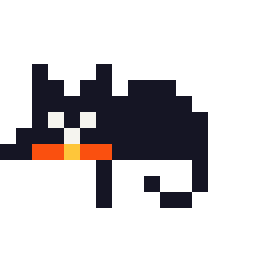
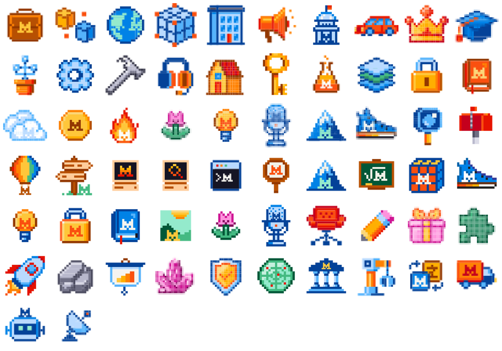
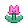

# Mistral AI Pixel Sprites

> An unofficial, searchable collection of transparent **Mistral AI pixel-art sprites**, model emblems, and animated pixel cats. Website screenshots, page thumbnails, opaque backgrounds, and duplicate assets are excluded.





## Library layout

| Folder | Contents |
| --- | --- |
| [`source/`](source) | All unique, original transparent sprites — SVG and WebP in one flat directory |
| [`animations/cats/`](animations/cats) | Animated transparent pixel cats in GIF |
| [`showcase/`](showcase) | Transparent overview image generated from `source/` |
| [`metadata/`](metadata) | Sources, SHA-256 hashes, and provenance |

## Quality policy

- Every retained image is a standalone transparent sprite or animation.
- Website screenshots, UI captures, hero images, card thumbnails, and opaque-background imagery are excluded.
- Identical source files are deduplicated by SHA-256.
- `source/` is the canonical asset directory; it contains no generated duplicates.

## Quick use

```html

```

```css
.pixel-sprite {
  image-rendering: pixelated;
}
```

## Source and provenance

Assets were collected from public pages on [mistral.ai](https://mistral.ai/) on 24 June 2026, including the [Mistral brand page](https://mistral.ai/brand/). The full per-file source record, page references, SHA-256 hash, and file size are available in [`metadata/manifest.csv`](metadata/manifest.csv) and [`metadata/manifest.json`](metadata/manifest.json).

## Important notice

This is an **unofficial, community-maintained archive**. Mistral AI names, logos, icons, artwork, and trademarks belong to Mistral AI and their respective owners. This repository does not grant any license or imply endorsement, partnership, or affiliation. Review the [official Mistral brand guidance](https://mistral.ai/brand/) before using these assets in a product, publication, or commercial work.

## Search keywords

Mistral AI pixel sprites · Mistral pixel art · Mistral transparent assets · Mistral model sprites · Mistral SVG sprites · Mistral WebP sprites · Mistral animated pixel cat
